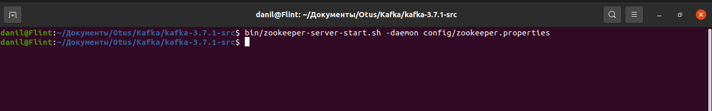
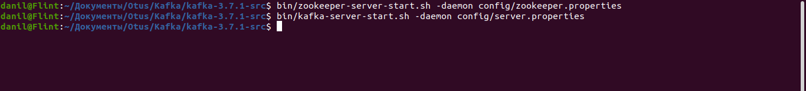
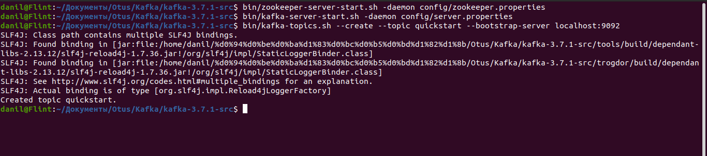
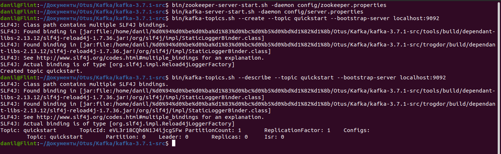
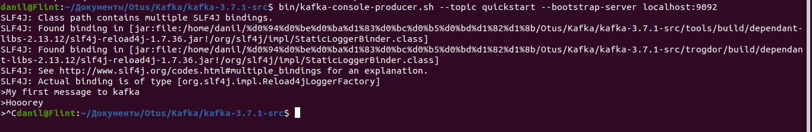
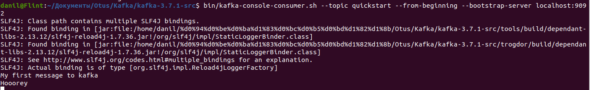

1. Запуск zookeeper.
   

2. Запуск kafka-broker.
   

3. Создание топика quickstart. Не увидел, что название должно быть test. Надеюсь на понимание.
   

4. Описание топика quickstart.
   

5. Запись сообщений в топик quickstart.
   

6. Чтение сообщений из топика quickstart.
   